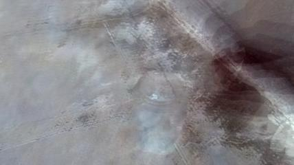

# Dynamic images
Based on [rank-pooling-python](https://github.com/MRzzm/rank-pooling-python)

Code for generating dynamic images in python.

> "Fernando, Basura, Efstratios Gavves, José Oramas, Amir Ghodrati, and Tinne Tuytelaars. "Rank pooling for action recognition." IEEE transactions on pattern analysis and machine intelligence 39, no. 4 (2017): 773-787.".



## Usage

```bash
$ python dynamic_images.py video_folder/ dynamic_image.jpg
```

## Requirements
* `numpy`
* `scikit-learn`
* `scipy`
